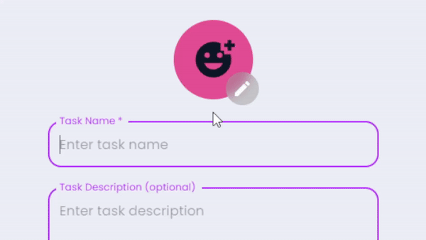

<!-- prettier-ignore -->

<h1>📝React.js Todo App</h1>

## ⚡ Features

- **📦 Local and session storage**: Save tasks locally and retain form data using session storage.
- **😜 Custom Emojis**: The app features custom emojis and different emoji styles to choose from, including Apple, Facebook, Twitter, Google and Native.
-
- **📱 Clean and responsive design**: Ensures smooth user experience on various devices.
- **🔍 Highlighted Links in Task Descriptions**: Links included in task descriptions will be visually highlighted for easier identification and access.
- **🌐 Native Intl Integration**: Adapts to your language, timezone, and date preferences using the native `Intl` API.
- **🌍 Browser Translation Support**: Seamlessly translate the entire page into different languages using your browser's translation feature, ensuring accessibility for users worldwide.
- **🗂️ Customizable Categories**: Users can create and personalize task categories to suit their preferences.
- **🨠Color Themes**: Users can choose several app color themes.   
- **🗃️ Multi-Task Selection**: Option to select multiple tasks and perform actions on all of them at once.   
- **🔎 Search Tasks**: Search functionality allows you to filter tasks by name or description, making it easy to find what you need.
- **🗣️ Task Reading Aloud**: Option to have tasks read aloud using the native `SpeechSynthesis` API, with a selection of voices to choose from.  
  
- **🤖 AI emoji choosing**: This uses `window.ai` which is an experimental feature that works only in dev version of Chrome with some flags enabled. [More info](https://afficone.com/blog/window-ai-new-chrome-feature-api/)  
  
- **📴 Works offline**: This app is a Progressive Web App (PWA), which means it can be installed on your device, used even when you're offline and behave like a normal application with shortcuts and badges. 
  

## 📷 Screenshots

## 🚀 Performance

## 💻 Tech Stack

- React
- Typescript
- Vite
- Emotion
- MUI

